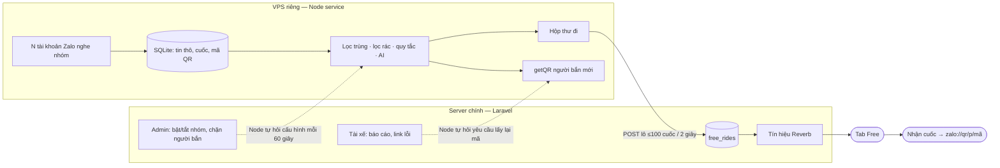
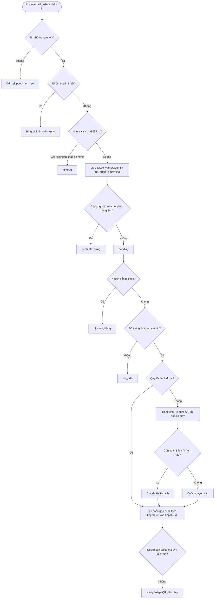
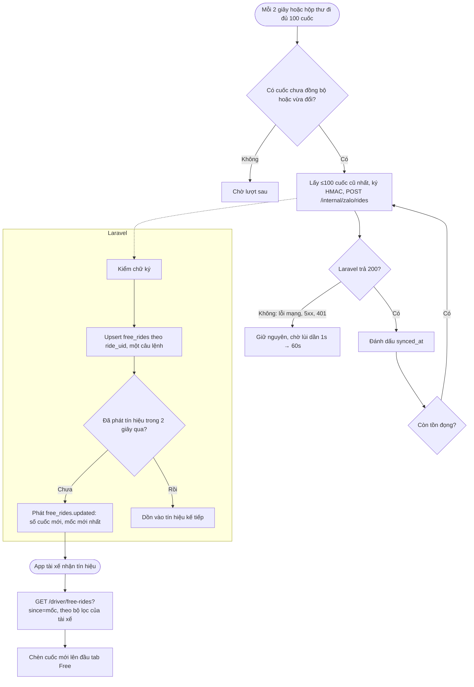
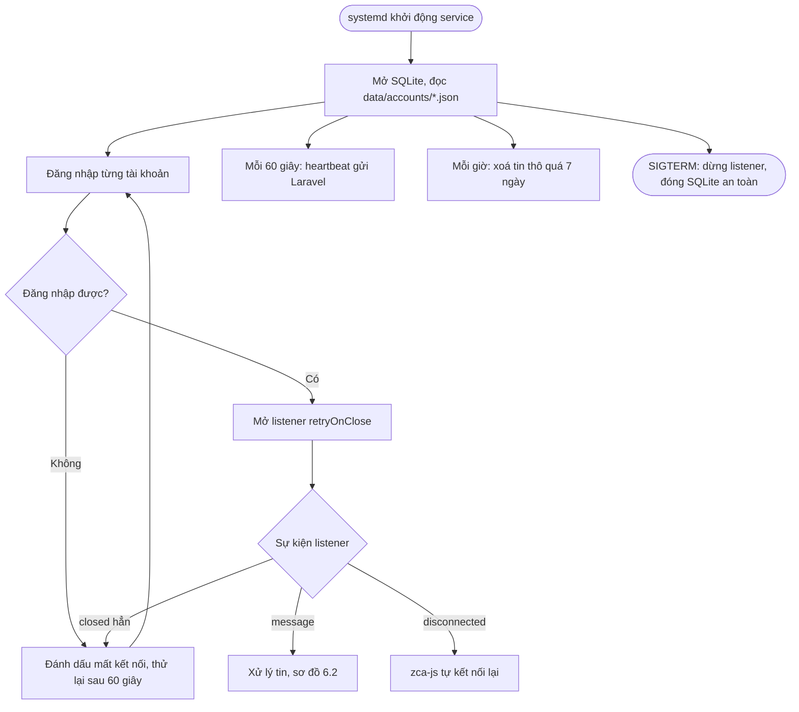
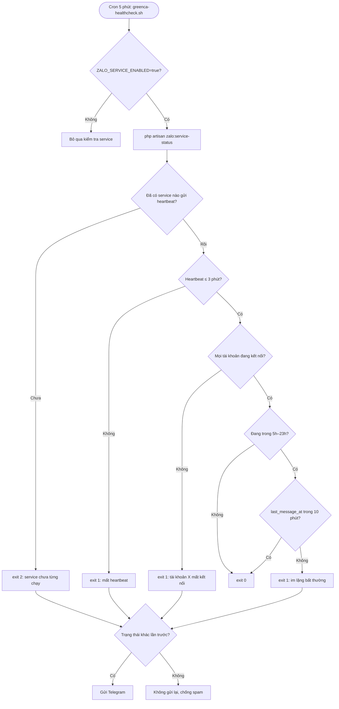

# Cuốc Free từ nhóm Zalo — Design

**Trạng thái:** Đã duyệt 04/10/2026. Cùng ngày cập nhật kiến trúc sang **hướng C — Node xử lý toàn bộ phần nặng, Laravel chỉ hiển thị**.
**Báo giá:** `docs/Bao_gia_Cuoc_Free_Zalo.pdf` (16.000.000đ + 1.000.000đ/tháng + phí AI theo thực tế).
**Kế hoạch giai đoạn 1:** `docs/superpowers/plans/2026-10-04-zalo-free-rides-phase1.md`

## 1. Mục tiêu

Tab **"Free"** trong app tài xế hiển thị cuốc miễn phí lấy tự động từ ~300 nhóm Zalo bắn cuốc (tham khảo app Lịch Xe trên iOS). Tài xế bấm **"Nhận cuốc"** → mở thẳng trang cá nhân Zalo của người bắn → hai bên tự trao đổi. GreenCA chỉ là trung gian kết nối: không thu phí, không trừ điểm, không theo dõi trạng thái cuốc. Mục đích kinh doanh: **phễu thu hút tài xế**, không phải chức năng lõi.

**Quy mô thiết kế:** 300 nhóm × ~500 tin/ngày ≈ **150.000 tin/ngày** (~2 tin/giây, cao điểm 10–20 tin/giây) → ước **10–30 nghìn cuốc sạch/ngày** (0,1–0,4 cuốc/giây, cao điểm 2–5 cuốc/giây).

## 2. Quyết định đã chốt

| Chủ đề | Quyết định |
| --- | --- |
| Nguồn tin | Tài khoản Zalo cá nhân phụ + thư viện `zca-js` (2.2.0) — **chỉ đọc**, không gửi tin, không kết bạn |
| Kiến trúc | **Hướng C**: microservice Node trên VPS riêng làm mọi phần nặng (nghe tin, lưu tin thô, lọc, AI, lấy mã QR); Laravel chỉ nhận cuốc sạch và hiển thị |
| Công nghệ service | **TypeScript**, **SQLite (WAL)**, **một tiến trình quản lý N tài khoản Zalo** |
| Tách cuốc | Từng tin: lọc trùng → lọc rác → quy tắc; tin khó: **Claude Haiku 4.5** theo nhóm nhỏ (≤ 20 tin hoặc 3 giây), có trần ngân sách theo ngày |
| Liên hệ người bắn | `getQR(uid)` → giải mã → lưu **chỉ đoạn mã** (vd `758z6tl22yft`) → nút "Nhận cuốc" mở `zalo://qr/p/<mã>` |
| Đồng bộ sang Laravel | Lô **tối đa 100 cuốc hoặc mỗi 2 giây** (điều kiện nào tới trước), upsert theo mã cuốc |
| Realtime | Laravel phát **tín hiệu nhỏ** (≤ 1 lần / 2 giây), app tài xế tự tải cuốc mới theo bộ lọc của mình |
| Báo cáo/ẩn | Tài xế báo cáo cuốc, ẩn người bắn; admin chặn người bắn toàn hệ thống (yêu cầu App Store mục 1.2) |

### Hỏi đáp đã chốt với khách (04/10/2026)

- **1.1 Khi một user vào nhóm, admin/bot có cần kết bạn với từng người không?** → **Không.** Đã kiểm chứng: `getQR(uid)` trả QR cho tài khoản chưa từng kết bạn/nhắn tin.
- **1.2 Người bắn nhắn rời rạc nhiều tin để thể hiện một cuốc thì sao?** → **Bỏ qua.** Chỉ xử lý tin chứa đủ thông tin trong **một** tin; không ghép nhiều tin.

### Năm nguyên tắc kiến trúc

1. **Lưu ngay khi nhận.** Tin vừa tới listener được ghi vào SQLite của service trước mọi bước xử lý — Laravel sập, mạng rớt hay AI lỗi cũng không mất tin.
2. **Xử lý từng tin, gom tin khi gọi AI.** Lọc trùng/rác/quy tắc chạy tức thì cho từng tin; chỉ phần cần AI mới gom nhóm nhỏ để không lặp phần hướng dẫn trong mỗi lần gọi.
3. **Hộp thư đi (outbox).** Cuốc sạch lưu với trạng thái chưa đồng bộ; chỉ đánh dấu đã đồng bộ khi Laravel trả 200; gửi lại không nhân đôi (upsert theo mã cuốc).
4. **Mọi kết nối đi ra từ Node.** Laravel không bao giờ gọi vào service; service tự hỏi Laravel cấu hình và việc cần làm mỗi 60 giây. VPS giữ phiên Zalo không mở cổng nào ra Internet.
5. **Laravel làm việc nhẹ nhất:** nhận cuốc sạch theo lô, lưu, phát tín hiệu realtime, phục vụ tab Free, báo cáo/ẩn, admin.

## 3. Kết quả kiểm chứng kỹ thuật (zca-js 2.2.0, bằng tài khoản của chính người dùng)

- **Nghe tin mới trong nhóm: được.** Mỗi tin có `uidFrom`, `dName`, `msgId`, `ts`.
- **`getGroupChatHistory`: lỗi 404 với mọi nhóm** → không bù được tin bị lỡ (đáng điều tra ở giai đoạn 2: `listener.requestOldMessages()`).
- **`getQR(uid)` trả QR cả khi chưa kết bạn** → mã QR giải ra `http://zaloapp.com/qr/p/<mã>`. Một người lạ ở lần thử đầu trả rỗng — nhiều khả năng do cài đặt quyền riêng tư của người đó (chưa kiểm chứng).
- **Mở profile:** `zaloapp.com/qr/p/<mã>` không mở được qua trình duyệt/bấm link. **`zalo://qr/p/<mã>`** mở đúng trang cá nhân, kể cả với tài khoản chưa kết bạn; Safari hỏi "Mở trong Zalo?" (PWA thêm 1 lần bấm; app native mở thẳng).
- **Mã QR không đổi theo lần gọi** (cùng tài khoản ra cùng mã ở 2 lần chạy). Chưa biết có hết hạn dài hạn không.
- **Không dùng được:** SĐT người lạ (luôn ẩn), `username` dạng `t_xxx`, `findUserByUsername` (chỉ tra ngược), Zalo Bot chính chủ (trong nhóm chỉ nhận tin @mention/reply), GMF (chỉ nhóm do OA tạo).

## 4. Kiến trúc

```
VPS riêng (Node, TypeScript)                                   Server chính (Laravel)
┌──────────────────────────────────────────────────┐            ┌─────────────────────────────┐
│ N tài khoản Zalo ─► listener ─► LƯU NGAY (SQLite)│            │                             │
│        từng tin: lọc trùng → lọc rác → quy tắc   │            │                             │
│        tin khó: gom nhóm nhỏ → Claude Haiku      │            │                             │
│        người bắn mới: getQR giãn nhịp → mã QR    │  POST lô   │ upsert free_rides (theo mã) │
│        hộp thư đi: cuốc chưa đồng bộ ───────────►│──có ký────►│ → tín hiệu Reverb → tab Free│
│        heartbeat + thống kê ────────────────────►│            │ → giám sát, Telegram        │
│        mỗi 60s hỏi cấu hình / việc cần làm ◄─────│◄──GET có ký│ admin: bật/tắt nhóm, chặn   │
└──────────────────────────────────────────────────┘            │ tài xế: báo cáo, link lỗi   │
                                                                └─────────────────────────────┘
```

### 4.1 Phân vai

| Việc | Node service | Laravel |
| --- | --- | --- |
| Nghe tin, lưu tin thô (7 ngày) | ✅ | — |
| Lọc trùng, lọc rác, tách cuốc, gọi AI, trần ngân sách AI | ✅ | — |
| `getQR`, lưu & làm mới mã QR | ✅ | — |
| Lưu cuốc sạch để hiển thị | Hộp thư đi | ✅ `free_rides` |
| Đăng nhập tài xế/admin, realtime, tab Free, báo cáo/ẩn | — | ✅ |
| Bật/tắt nhóm, chặn người bắn, yêu cầu lấy lại mã QR | Đọc qua `GET /config` | ✅ lưu và phục vụ |
| Giám sát, cảnh báo Telegram | Gửi heartbeat | ✅ `zalo:service-status` + healthcheck |

### 4.2 Dữ liệu

**SQLite của service (`data/zalo.sqlite`):**

- `chat_groups` (không đặt tên `groups` vì `GROUPS` là từ khoá của SQLite): `zalo_group_id` (PK), `name`, `last_message_at`.
- `senders`: `uid` (PK), `display_name`, `last_seen_at`; giai đoạn 2 thêm `qr_code`, `qr_fetched_at`, `qr_status` (`ok | empty | error`).
- `messages` (tin thô, giữ 7 ngày): `zalo_group_id`, `zalo_msg_id` (UNIQUE cặp), `sender_uid`, `account_id`, `content`, `content_hash`, `sent_at`, `received_at`, `parse_status` (`pending | duplicate | not_ride | ride | blocked | failed`).
- Giai đoạn 2: `rides` (hộp thư đi: `ride_uid`, `message_id`, `sender_uid`, các trường cuốc, `fingerprint`, `group_count`, `expires_at`, `updated_at`, `synced_at`), `ai_usage` (theo ngày: số lần gọi, token, chi phí).

**MySQL của Laravel (giai đoạn 2–3):** `free_rides` (`ride_uid` unique, thông tin cuốc, `sender_uid`, `sender_name`, `qr_code`, `group_name`, `group_count`, `expires_at`), `zalo_groups` (danh sách nhóm do service đồng bộ + cờ `enabled` do admin quản lý), `zalo_sender_blocks`, `free_ride_reports`, `driver_hidden_senders`, `zalo_qr_refresh_requests`.

### 4.3 Hợp đồng Node ↔ Laravel

Mọi request do **Node** khởi tạo, ký header `X-Zalo-Timestamp` + `X-Zalo-Signature` = hex `HMAC-SHA256(ZALO_BOT_SECRET, "{timestamp}.{raw body}")`, lệch giờ > 300 giây → 401.

| Endpoint (Laravel) | Tần suất | Nội dung | Giai đoạn |
| --- | --- | --- | --- |
| `POST /api/internal/zalo/heartbeat` | 60 giây | `service_id`, `accounts[{id, connected}]`, bộ đếm, `last_message_at` | 1 |
| `POST /api/internal/zalo/rides` | ≤ 100 cuốc hoặc 2 giây | Cuốc sạch, upsert theo `ride_uid`; Laravel trả 200 thì Node đánh dấu `synced_at` | 2 |
| `POST /api/internal/zalo/groups` | 10 phút | Danh sách nhóm + số tin 24 giờ (cho trang admin) | 2 |
| `GET /api/internal/zalo/config` | 60 giây | `disabled_group_ids`, `blocked_sender_uids`, `qr_refresh_uids`, `ai_daily_budget_usd` | 2 |

Khi Laravel sập: hộp thư đi dồn lại; khi sống lại, Node gửi bù **từng lô 100 cuốc, tuần tự** cho tới khi hết (10 nghìn cuốc ≈ 100 request).

### 4.4 Realtime tới tài xế (giai đoạn 3)

Reverb giới hạn mỗi tin nhắn **10 KB** (`max_message_size` / `max_request_size` trong `config/reverb.php`); một lô 100 cuốc ~60 KB. Vì vậy, giống `DriverTripsUpdated` hiện có (chỉ mang `type` + `booking_id`):

- Laravel phát `free_rides.updated` kèm **số cuốc mới + mốc thời gian mới nhất**, tối đa **1 lần / 2 giây**.
- App tài xế gọi `GET /driver/free-rides?since=<mốc>` (áp bộ lọc khu vực/giờ/loại xe của tài xế) rồi chèn cuốc mới lên đầu danh sách.

### 4.5 Xử lý một tin trong service

1. Listener của tài khoản X nhận tin → bỏ tin không phải chữ trong nhóm (đếm `skipped_non_text`).
2. Nhóm bị admin tắt → bỏ qua (giai đoạn 2).
3. Cặp `(nhóm, msg_id)` đã lưu (tài khoản khác cùng nghe) → `ignored`.
4. **Lưu ngay** tin thô + cập nhật nhóm, người gửi (tên rỗng không ghi đè tên đã biết).
5. Cùng người gửi + nội dung đã chuẩn hoá trong 24 giờ (tính theo `sent_at`) → `duplicate`, dừng.
6. (Giai đoạn 2) Người bắn bị chặn → `blocked`; thiếu thông tin trong một tin → `not_ride`; quy tắc tách được → cuốc; không thì vào hàng chờ AI; chạm trần ngân sách → cuốc nguyên văn.
7. (Giai đoạn 2) Gộp cuốc gần trùng theo `fingerprint` (tăng `group_count`); người bắn chưa có mã QR còn mới (> 7 ngày) → hàng đợi `getQR` giãn nhịp.

## 5. Vận hành & rủi ro

- **Khoá tài khoản phụ:** chuẩn bị 2–3 nick (GreenCA cấp); service chỉ đọc + giãn nhịp `getQR`. Một tài khoản lỗi không làm dừng các tài khoản khác; tài khoản lỗi tự đăng nhập lại sau 60 giây.
- **Mất tin khi listener rớt** (không có lịch sử) → cảnh báo khi tài khoản mất kết nối hoặc im lặng bất thường (300 nhóm mà 10 phút không có tin, trong khung 5h–23h).
- **Một tiến trình cho N tài khoản:** tiến trình chết → systemd khởi động lại sau vài giây; tin đã lưu không mất, chỉ lỡ tin trong lúc khởi động.
- **Chi phí AI:** ước 3,8–11 triệu/tháng; chốt sau 2–3 ngày thu thập dữ liệu thật (giai đoạn 1, chưa gọi AI) bằng lệnh thống kê của service.
- **Pháp lý:** hiển thị lại tin nhóm + link profile người bắn — GreenCA chịu trách nhiệm (đã ghi trong báo giá).

## 6. Sơ đồ hoạt động

### 6.1 Toàn cảnh



### 6.2 Service xử lý một tin

Giai đoạn 1 làm tới bước "duplicate / pending"; phần dưới thuộc giai đoạn 2.



### 6.3 Đồng bộ cuốc sang Laravel và realtime (giai đoạn 2–3)



### 6.4 Vòng đời service và tài khoản



### 6.5 Giám sát và cảnh báo



## 7. Giai đoạn triển khai

| Giai đoạn | Node service | Laravel |
| --- | --- | --- |
| **1 — Thu tin thô** | Listener N tài khoản, lưu tin thô + lọc trùng vào SQLite, tự dọn sau 7 ngày, lệnh thống kê, heartbeat | Middleware chữ ký, endpoint heartbeat, `zalo:service-status`, kiểm tra trong healthcheck |
| **2 — Tách cuốc** | Quy tắc tách + AI (trần ngân sách), `getQR`, hộp thư đi, hỏi cấu hình | Endpoint `rides`, `groups`, `config`; bảng `free_rides`, `zalo_groups`, `zalo_sender_blocks`, `zalo_qr_refresh_requests` |
| **3 — Tab Free** | — | Tab Free + bộ lọc, nút "Nhận cuốc", tín hiệu realtime, báo cáo/ẩn, "Báo link lỗi" |
| **4 — Quản trị** | — | Trang admin nhóm/người bắn/chi phí AI; kiểm thử tải 150k tin/ngày |

## 8. Việc còn mở

- Tỷ lệ người bắn trả QR rỗng (đo khi chạy thật).
- Mã QR có hết hạn dài hạn không → điều chỉnh chu kỳ làm mới.
- Hành vi PWA chế độ màn hình chính và Chrome Android khi mở `zalo://` (có hỏi xác nhận không).
- Danh mục khu vực cho bộ lọc (theo sân bay / quận / tỉnh).
- `listener.requestOldMessages()` có bù được tin lỡ không.
